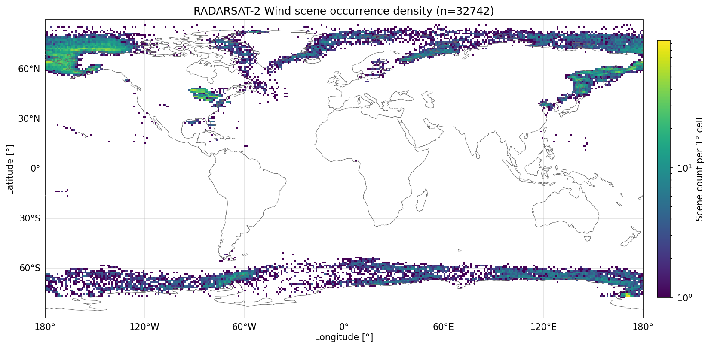
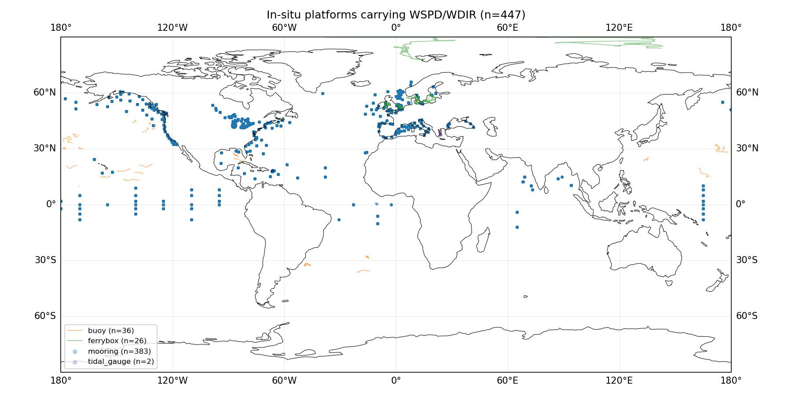
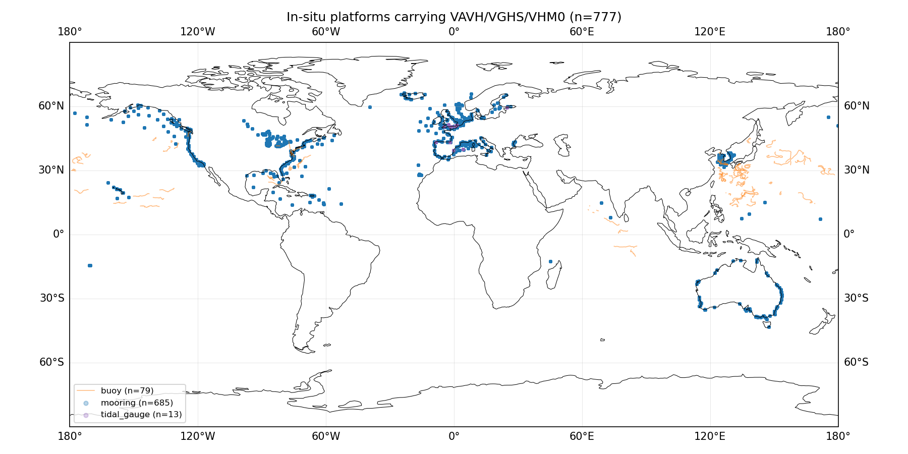
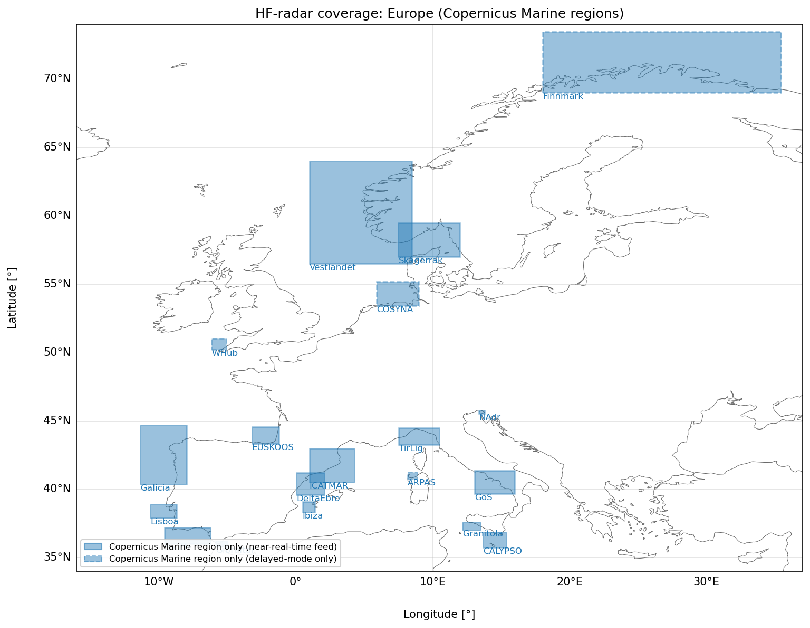
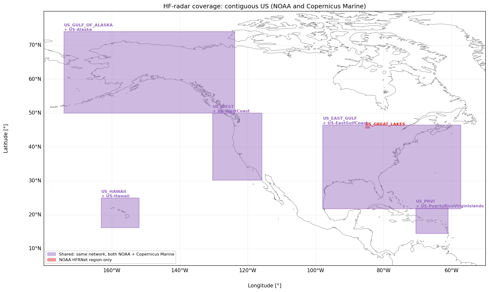
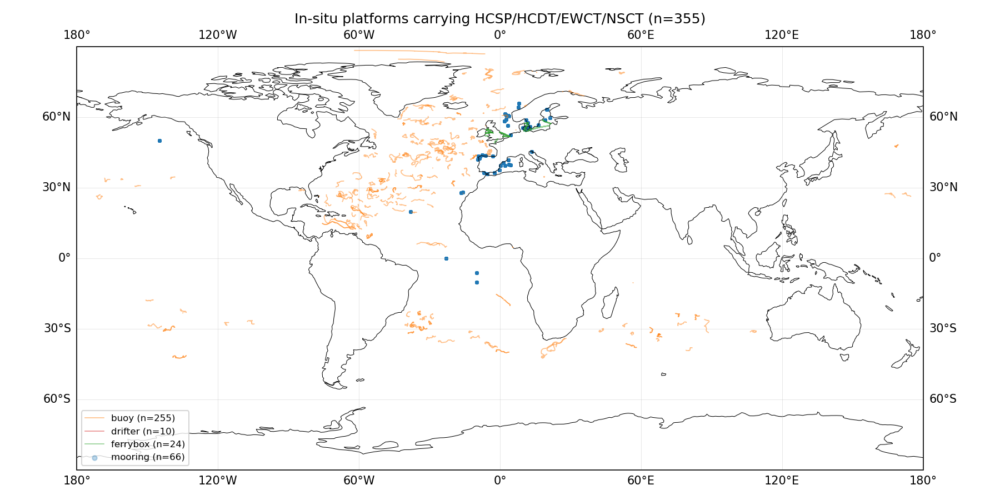

.. _`sec:ref`:

Reference datasets description
==============================

In ``l2o-qc``, reference data are used for both calibration and validation of SAR-derived geophysical parameters. The L2 calibration process is exclusively implemented through Numerical Weather Prediction Ocean Calibration (NOC), which is specifically applied to the wind vector under the OSVS thematic area. Validation is performed against multiple independent reference sources for all thematic areas. The following sections describe the reference datasets used for calibration and validation purposes.

Ocean Surface Vector Stress
---------------------------

Wind vector
~~~~~~~~~~~

C-band SAR
^^^^^^^^^^

Sentinel-1 L2 OCN - OWI
'''''''''''''''''''''''

**Description:**

Ocean Wind field (OWI) component of the Sentinel-1 Level-2 Ocean (L2_OCN) product, providing 10 m neutral wind speed and direction on a regular grid, derived from the Level-1 SAR backscatter using a CMOD5.N geophysical model function. The OWI component is available in Sentinel-1 Interferometric Wide (IW), Extra Wide (EW), and Stripmap (SM) acquisition modes.

In general, L1 and L2 Sentinel-1 products are generated by the Instrument Processing Facility (IPF) and carry an ``ipf_version`` with them to distinguish between different processing versions.

**Characteristics:**

land pixels are masked in the source product. The OWI product is typically delivered at an 1x1 km grid for all acquisition modes. The nominal swath widths are mode dependent with IW :math:`\sim 250` km, EW :math:`\sim 400` km, and SM :math:`\sim 80` km.

**Data quality:**

The OWI product carries a ``wind_quality`` flag and an ``inversion_quality`` flag. ``inversion_quality`` is related to the inversion, which depends on the NRCS, incidence angle, azimuth look angle and ancillary wind speed and direction. The ``inversion_quality`` flag indicates the consistency between SAR and ancillary winds. The ``wind_quality`` flag is more general including both the inversion quality as well as the geophysical quality for the whole product.

The ``inversion_quality`` flag has the following values:

- 0: high quality

- 1: medium quality

- 2: low quality

The ``wind_quality`` flag has had several different classifications. Currently (``ipf_version`` :math:`= 4.03`) it ranges from 0 – 4, where:

- 0: no data

- 1: bad

- 2: suspect

- 3: acceptable

- 4: good.

In the past (``ipf_version`` :math:`<4.03`), its range ran from 0 – 3, where:

- 0: high quality

- 1: medium quality

- 2: low quality

- 3: bad quality.

To avoid interpreting the wrong meaning, ``wq_flag_meanings`` is read from the metadata before filtering.

Only high/medium (acceptable/good) flags are accepted. In addition, data points are rejected when both flags are NaN.

**Availability:**

3 April 2014 - present with global coverage (6 days revisit rate).

**Dataset acquisition:**

Copernicus Data Space Ecosystem (https://dataspace.copernicus.eu/); OData catalogue/download API at https://catalogue.dataspace.copernicus.eu/odata/v1/Products; free registration required.

RADARSAT-2 Wind
'''''''''''''''

**Description:**

An independently-derived high-resolution sea surface wind speed product distributed by NOAA/NCEI, derived from RADARSAT-2 C-band SAR backscatter. Wind speed at 10m height is retrieved by inverting the CMOD4 geophysical model function.

**Characteristics:**

wind speed only (sub-kilometer pixel resolution). The accompanying direction field is the NWP-model direction used to resolve the CMOD4 180\ :math:`^\circ` ambiguity, not an independently retrieved SAR direction.

Two distinct filename/metadata eras exist in the archive (pre- and post-2024).

**Data quality:**

Post-2024 RADARSAT-2 wind files carry ``pixel_level_quality_flags`` parameter that can be used to mask land/ice/quality. A cell is deemed valid when this flag equals 5 (“valid wind in valid water region"). Pre-2024 files only contain a coarser mask/ice-mask combination, which is used as fallback ``mask==-1 & icemask==1``. All other cells are given ``NaN`` as value.

**Availability:**

May 2014 - present (:math:`\sim 1` month latency). The available data via NOAA is heavily centered around the polar regions with most occurrences near Alaska and the Bering strait as can be seen in Figure :numref:`fig:radarsat2_coverage`.

   Coverage of RADARSAT-2 high resolution sea surface winds via the NOAA/NCEI THREDDS archive. The center locations of all 32742 available RADARSAT-2 products from May 2014 - July 2026 have been plotted.

**Dataset acquisition:**

NOAA NCEI THREDDS catalogue, https://www.ncei.noaa.gov/thredds-ocean/catalog/sar-winds/radarsat2/catalog.html (public, no authentication); per-granule bounding boxes are available via THREDDS’ NCML metadata service, avoiding full-file downloads for non-overlapping scenes.

Numerical Prediction Model
^^^^^^^^^^^^^^^^^^^^^^^^^^

ERA5 Reanalysed wind
''''''''''''''''''''

**Description:**

hourly, global 10 m wind field from ECMWF’s ERA5 atmospheric reanalysis, produced under the Copernicus Climate Change Service (C3S) and distributed via the Copernicus Climate Data Store (CDS). Used as an independent, model-based reference wind field, collocated via bilinear spatial and hyperbolic temporal interpolation rather than point/swath matching.

**Characteristics:**

global regular latitude/longitude grid at 0.25° spacing, hourly output. The 10 m zonal and meridional wind components (:math:`u_{10}`, :math:`v_{10}`) are retrieved from the ``reanalysis-era5-single-levels`` dataset, together with a land-sea mask (``lsm``); wind speed and direction are derived after interpolation to the query location.

**Data quality:**

grid cells/query points with :math:`\mathrm{lsm} > 0.5` (land) are excluded before collocation. ERA5 is documented and evaluated in (Hersbach et al. 2020); an independent characterisation of its 10 m wind field (Belmonte Rivas and Stoffelen 2019) reports mean wind biases of up to 0.5 m/s in the zonal and meridional components, stable over time (interannual variability :math:`\sim`\ 0.1 m/s), and roughly 20% lower instantaneous RMS wind speed error than the preceding ERA-Interim reanalysis.

**Availability:**

1940 - present with global coverage. A preliminary near-real-time extension (ERA5T, :math:`\sim`\ 5 day latency) is later superseded by the quality-controlled final release (:math:`\sim`\ 3 month latency).

**Dataset acquisition:**

CDS dataset ``reanalysis-era5-single-levels``, via the ``cdsapi`` Python client; requires free CDS registration, with the API key stored in ``~/.cdsapirc``.

In-Situ Observations
^^^^^^^^^^^^^^^^^^^^

ECMWF MARS archive
''''''''''''''''''

**Description:**

Buoy observations relayed onto the WMO Global Telecommunication System (GTS) and archived by ECMWF’s Meteorological Archival and Retrieval System (MARS), retrieved with ``obstype=181/182`` (BUFR moored and drifting buoys respectively). Relevant variables are near-surface wind speed (``WSPD``) and direction (``WDIR``). As default, ``l2o-qc`` validates against GTS. Copernicus Marine in-situ data (see :ref:`subpar:cmems_insitu`) can be used as alternative or a waterfall combining both: the waterfall downloads both sources for the full recipe bounding box and window, then at collocation-tree build time drops any Copernicus Marine station whose platform ID GTS already reported for that window, preferring GTS’s value wherever GTS itself reports.

**Characteristics:**

point observations at native platform sampling rate ranging from once every 3-hrs to every 6-minutes. Default collocation in ``l2o-qc`` uses the point vs layer scheme with aggregation windows of :math:`\pm`\ 30 min / 5 km default radii (user adjustable via the ``.yaml`` recipe file).

**Data quality:**

Individual GTS BUFR reports carry no per-observation quality flag, because GTS requires the data processing center that owns a buoy to run automatic real-time quality control before an observation is transmitted onto the GTS (Panel 2011). The mandated real-time checks include, among others:

- Gross error checks against fixed physical limits. For wind, 0–100 m/s (speed) and 0–360\ :math:`^\circ` (direction).

- Climatological limit checks against operator- or International Comprehensive Ocean-Atmosphere Data Set (ICOADS)-supplied bounds for the platform’s location and season.

- Land/sea test; any observations that appear on land are rejected.

- Location sanity checks (rejecting :math:`(0,0)`, :math:`\pm180^\circ`, :math:`\pm90^\circ` sentinel coordinates; a drifting buoy’s position older than 48 hours, or a moored buoy’s position older than its own (re-)deployment age).

- Checksum/Cyclic Redundancy Checks (CRC) validation of the transmision link between platform, satellite, and ground station.

- Duplicate/near-duplicate observation suppression, and cascading rejection when an associated depth level or compensating sensor itself fails QC.

In addition to the quality checks performed by the owners of the platforms before ingestion into the GTS database, there are delayed mdoe quality control guidelines in place. Principle meteorological and oceanographic centers, including ECMWF, compare buoy reports against NWP model analysis to check for erroneous or biased data, feeding corrections back to the platform operators (Panel 2011).

**Availability:**

The ECMWF MARS archive has archived data from 28-11-2016 - present.

**Dataset acquisition:**

ECMWF MARS archive (https://www.ecmwf.int/en/forecasts/access-forecasts/access-archive-datasets), ``obstype=181/182`` (BUFR moored and drifting buoys), retrieved via the ``ecmwf-api-client`` Python package (``ecmwfapi.ECMWFService``); credentials read from ``~/.ecmwfapirc`` (ECMWF’s standard Web API key file), obtained through an ECMWF Member/Co-operating-State-affiliated account. The request shape is day-based and global, meaning that each retrieval contains all wind, wave, and currents sections a given buoy reported for that day. Data is provided in daily BUFR files.

.. _`subpar:cmems_insitu`:

Copernicus Marine
'''''''''''''''''

**Description:**

Dataset ID INSITU_GLO_PHYBGCWAV_DISCRETE_MYNRT_013_030, which contains in-situ observations. Relevant platforms reporting near-surface wind speed (``WSPD``) and direction (``WDIR``) are moored buoys, drifting buoys, ferryboxes, and tidal gauges.

**Characteristics:**

point observations at native platform sampling rate, which is typically hourly or every 10-minutes. Default collocation in ``l2o-qc`` uses point vs layer collocation. The aggregation windows, which are user adjustable via the ``.yaml`` file, utilize :math:`\pm`\ 30 min / 5 km aggregation radii.

**Data quality:**

Copernicus Marine in situ Thematic Assembly Centre (TAC) has no commitment to manage in situ meteorological observations. Reported quality flags are kept in the NetCDF files, with no additional quality control (Wehde et al. 2025). The QC flag ranges from 0 – 9 (Copernicus In Situ Tac Data Management Team 2025):

- 0: No QC was performed

- 1: Good data

- 2: Probably good data

- 3: Bad data although potentially correctable

- 4: Bad data

- 5: Value changed

- 6: Value below detection/quantification

- 7: Nominal value (e.g. reported rather than observed value like instrument target depth)

- 8: Interpolated value

- 9: Missing value

Due to the lack of additional quality control, buoy data from the ECMWF MARS archive is preferred.

**Availability:**

Platform dependent, the Copernicus marine environment monitoring services (CMEMS) dataset provides both historical data per platform and recent data. Not all platforms have both ``WSPD`` and ``WDIR`` available. Geographical coverage in 2026 can be seen in Figure :numref:`fig:in_situ_wind_coverage`.

   Coverage of Copernicus Marine in-situ platforms that provided wind speed and direction during the first half of August 2026.

**Dataset acquisition:**

Copernicus Marine in-situ dataset (https://data.marine.copernicus.eu/product/INSITU_GLO_PHYBGCWAV_DISCRETE_MYNRT_013_030/), download via the ``copernicusmarine`` Python client (free registration).

Scatterometers
^^^^^^^^^^^^^^

ASCAT
'''''

**Description:**

L2 product of 10 m neutral wind speed and direction wind-vector cells (WVCs) retrieved from C-band backscatter measured by the Advanced Scatterometer (ASCAT) aboard MetOp-B and MetOp-C, processed and distributed by EUMETSAT’s Ocean and Sea Ice Satellite Application Facility (OSI-SAF) as product OSI-104 ("ASCAT Wind Product").

**Characteristics:**

dual fan-beam swath geometry, two :math:`\sim`\ 550 km wide swaths either side of the sub-satellite track separated by a :math:`\sim`\ 360 km nadir gap; wind-vector cells are provided on a regular along-/across-track grid at 12.5 km spacing. Data are distributed as 2-D swath NetCDF files and flattened to a point-geometry representation before collocation.

**Data quality:**

each WVC carries a bitmask ``wvc_quality_flag``; cells for which any of the following bits are set are rejected before collocation:

- some portion of the WVC is over land

- some portion of the WVC is over ice

- wind inversion not successful

- not enough good :math:`\sigma_0` measurements for wind retrieval

- distance to the geophysical model function (GMF) too large

Furthermore, the OSI-SAF ASCAT (Metop-B/C) global 25 km and coastal 12.5 km wind products have been validated using buoys and triple collocation (Verspeek et al. 2019), showing wind quality well within the OSI-SAF product requirements (:math:`<2` m/s wind component standard deviation, :math:`<0.5` m/s speed bias). Against buoys, speed bias of 0.10/0.08 m/s and u-/v-component standard deviations of 1.62/1.90 (Metop-B) and 1.59/1.89 m/s (Metop-C) were found at 12.5 km. Triple collocation gives scatterometer-perspective errors of 0.62/0.78 (Metop-B) and 0.67/0.78 m/s (Metop-C) in the u-/v-components at 12.5 km (Verspeek et al. 2019).

**Availability:**

MetOp-B (launched 2012) and MetOp-C (launched 2018) provide continuous global coverage.

**Dataset acquisition:**

EUMETSAT Data Store, collection ``EO:EUM:DAT:METOP:OSI-104``, via the ``eumdac`` Python client (free registration).

HY-2B/HY-2C
'''''''''''

**Description:**

10 m wind speed and direction wind-vector cells retrieved from Ku-band backscatter measured by the scatterometers aboard Haiyang-2B (HY-2B) and Haiyang-2C (HY-2C) ocean satellites (CNSA/NSOAS), reprocessed into the same OSI-SAF wind-product format/flag conventions as ASCAT and redistributed via KNMI’s OSI-SAF wind FTP server.

**Characteristics:**

HY-2B/HY-2C carry a Ku-band, wide-swath (:math:`\sim`\ 1700 km) pencil-beam scatterometer; wind-vector cells are provided at 25 km spacing/resolution.

**Data quality:**

the same ``wvc_quality_flag`` bitmask and rejection criteria as ASCAT (see above) apply, capable of flagging rainy WVCs. Furthermore, the OSI-SAF HY-2B and HY-2C wind products have been validated using buoys and triple collocation (Verhoef et al. 2024), showing wind quality well within the OSI-SAF product requirements (:math:`<2` m/s wind component standard deviation , :math:`<0.5` m/s speed bias). Against buoys, speed bias of -0.09/-0.06 m/s and u-/v-component standard deviations of 1.68/1.64 m/s (HY-2B) and 1.75/1.76 m/s (HY-2C) were found. Triple collocation gives scatterometer-perspective errors of 0.59/0.39 (HY-2B) and 0.81/0.65 (HY-2C) in the u-/v-components (Verhoef et al. 2024).

**Availability:**

HY-2B (launched 2018) and HY-2C (launched 2020) are operational and provide global coverage. However, currently only the most recent 3 days with a :math:`\sim2.5` hour latency (rolling window) are automatically available in ``l2o-qc``. Data is available in both NetCDF and BUFR format.

**Dataset acquisition:**

OSI-SAF wind FTP server (``ftppro.knmi.nl``), directories ``/scat/netcdf/hy2b`` and ``/scat/netcdf/hy2c``; registered OSI-SAF FTP credentials required. Only a 3-day rolling window is available.

Oceansat-3
''''''''''

**Description:**

10 m sea surface wind speed and direction wind-vector cells retrieved from the Ku-band scatterometer aboard ISRO’s Oceansat-3 (EOS-06), reprocessed into the OSI-SAF wind-product format and redistributed via the same KNMI FTP server as HY-2B/HY-2C.

**Characteristics:**

same 25 km wind-vector-cell spacing and Ku-band, wide-swath pencil-beam geometry as HY-2B/HY-2C.

**Data quality:**

same ``wvc_quality_flag``-based rejection criteria as ASCAT/HY-2B/HY-2C. Furthermore, the OSI-SAF Oceansat-3 wind products have been validated using buoys and triple collocation (Verhoef et al. 2024), showing wind quality well within the OSI-SAF product requirements (:math:`<2` m/s wind component standard deviation , :math:`<0.5` m/s speed bias). Against buoys, speed bias of -0.16 m/s and u/v component standard deviations of 1.72/1.68 m/s were found (Verhoef et al. 2024). Triple collocation gives scatterometer-perspective errors of 0.68/0.54 in the u-/v-components (Verhoef et al. 2024).

**Availability:**

Oceansat-3 launched November 2022 and provides global coverage. Similarly to HY-2B and HY-2C, currently only the most recent 3 days with a :math:`\sim2.5` hour latency (rolling window) are available in ``l2o-qc``. Data is available in both NetCDF and BUFR format.

**Dataset acquisition:**

OSI-SAF wind FTP server (``ftppro.knmi.nl``), directory ``/scat/netcdf/oceansat3``; registered OSI-SAF FTP credentials required. Only a 3-day rolling window is available.

Radiometers
^^^^^^^^^^^

RSS microwave radiometers (AMSR2, GMI, SSMIS, WindSat)
''''''''''''''''''''''''''''''''''''''''''''''''''''''

**Description:**

Level-3 (L3), daily, global 10 m ocean surface wind speed products retrieved from passive microwave brightness temperatures, produced by Remote Sensing Systems (RSS) for six sensors: AMSR2 (GCOM-W1, JAXA), GMI (GPM, NASA/JAXA), SSMIS (DMSP F16/F17/F18; NASA), and WindSat (Coriolis, US Navy). WindSat additionally provides wind direction via its polarimetric channels; the other sensors are wind-speed-only.

**Characteristics:**

each sensor is distributed as a daily file already resampled to a common global 0.25° grid, with two passes (ascending/descending) per file and a per-cell measurement time. AMSR2 is published in NetCDF; GMI, SSMIS, and WindSat are distributed as gzipped RSS binary bytemaps. Wind speed is retrieved from a shared physical emissivity model (Meissner and Wentz 2012); cells under rain, land, or ice are already set to fill/NaN by RSS.

**Data quality:**

no per-cell quality bitmask is exposed; instead, invalid retrievals (rain-, land-, or ice-contaminated cells) are already flagged as fill values by RSS and dropped on read. Under rain-free conditions, RSS radiometer wind speed retrievals have a reported accuracy of :math:`\sim`\ 1 m/s RMS against buoys (Meissner and Wentz 2012); WindSat wind direction retrieval accuracy (all-weather algorithm) ranges from :math:`\sim`\ 10° in light rain to :math:`\sim`\ 30° at the onset of heavy rain, with wind speed accuracy degrading from 2 m/s to 4 m/s over the same range (Meissner and Wentz 2009).

**Availability:**

AMSR2 (2012-present), GMI (2014-present), SSMIS F16 (2003-present), SSMIS F17 (2006-present), SSMIS F18 (2009-present), WindSat (2003-present); all provide global coverage via twice-daily (ascending/descending) overpasses.

**Dataset acquisition:**

Remote Sensing Systems public HTTPS archive (https://data.remss.com/), no account required; AMSR2 as NetCDF, GMI/SSMIS/WindSat as gzipped binary bytemaps.

Plane
^^^^^

SFMR
''''

Dropsonde
'''''''''

Wind stress
~~~~~~~~~~~

Sea State
---------

Total significant wave height
~~~~~~~~~~~~~~~~~~~~~~~~~~~~~

NWP
^^^

WAVEWATCH III
'''''''''''''

**Description:**

NOAA/NCEP’s operational third-generation spectral wave model WAVEWATCH III (WW3), currently run as GFS-Wave and one-way coupled into the Global Forecast System (GFS) v16 via the NEMS/NUOPC coupling infrastructure. Used as an independent, physics-based wave-model reference, collocated via bilinear spatial and hyperbolic temporal interpolation. The current operational code version (v6.07, released by the WAVEWATCH III Development Group in 2019 as the model’s first open-development GitHub release), run with the ST4 source-term physics package (wind input and dissipation) of (Ardhuin et al. 2010).

**Characteristics:**

global 0.16° regular latitude/longitude grid, with finer nested regional grids covering the Atlantic, East Pacific, and West Coast (all 0.16°), the Arctic (9 km), and the Southern Ocean (0.25°); the finest grid whose bounding box fully contains the query region is selected, falling back to the global grid otherwise. GFS-Wave initialises four times daily (00/06/12/18 UTC); ``l2o-qc`` reconstructs an hourly series from each cycle’s short-range forecast leads. The model parameter significant height of combined wind waves and swell (``HTSGW``) is used as validation against SAR significant wave height.

**Data quality:**

no per-cell quality flag is provided in the GRIB2 output; land points are implicitly absent from the ocean model grid. The ST4 physics package used by the current operational configuration has been shown to outperform the older ST2 (Tolman–Chalikov) package used by earlier WAVEWATCH III code versions across most sea states, with the largest improvement in storm/extreme conditions add citation.

**Availability:**

From March 2021 (GFSv16/v6.07 implementation) – present, global coverage, published four times daily with hourly archived output between cycles.

**Dataset acquisition:**

NOAA Open Data on AWS, bucket ``noaa-gfs-bdp-pds`` (https://noaa-gfs-bdp-pds.s3.amazonaws.com), public and unsigned HTTPS/S3 access, no authentication required; GRIB2 format, parsed via the ``eccodes``/``cfgrib`` libraries.

.. _c-band-sar-1:

C-band SAR
^^^^^^^^^^

Sentinel-1 L2 OCN - OSW
'''''''''''''''''''''''

**Description:**

The OSW component of the S1 L2_OCN product provides partition-based wave parameters, including a significant wave height ``hs`` for each identified wave partition, as well as a vignette-level total significant wave height [m], ``total_hs``, and its standard deviation, ``total_hs_standard_deviation``. The partition quantities describe individual wave systems resolved in the OSW wave spectrum, whereas ``total_hs`` represents an integrated sea-state estimate for the vignette. From IPF 3.9.0 onward the ``total_hs`` implementation is based on a variant of the deep-learning approach of Quach et al. (Quach et al. 2021). The OSW component is generated for Stripmap (SM) and Wave (WV) acquisition modes.

**Characteristics:**

in WV mode, acquisitions consist of isolated :math:`\sim 20 \times 20` km vignettes roughly 200 km apart along the orbit track, rather than a continuous swath, with one wave spectrum estimate per vignette.

In SM mode, the  80×170 km swath itself is tiled into a grid of  20×20 km OSW cells without gaps in between, unlike WV’s sparse sampling. Each OSW cell contains its own independent wave spectrum/partition estimate.

**Data quality:**

The OSW product carries a total ``quality_flag`` (0 – 3), a per-partition ``partition_quality_flag`` (0 – 4), a ``land_flag``, a per-partition ``wave_direction_partition_ambiguity`` flag, and a scalar ``snr``, where for the total quality flag:

- 0: high quality

- 1: medium quality

- 2: low quality

- 3: bad quality

and, similarly but more finely graded, for the per-partition quality flag:

- 0: very good

- 1: good

- 2: medium

- 3: low

- 4: poor

The ``wave_direction_partition_ambiguity`` flag (0 or 1) indicates, per partition, whether the retrieved wave propagation direction is uniquely resolved or subject to the inherent :math:`180^\circ` ambiguity of SAR-derived wave direction; as it concerns direction rather than the wave height itself, it is not used for filtering ``total_hs``.

Data points are rejected when the total quality flag (``quality_flag``) is :math:`\geq 2`, or when the land flag is set. However, the total quality flag currently only contains fill values as it does not seem to be populated by the operational processor.

**Availability:**

3 April 2014 – present. Unlike OWI’s continuous-swath coverage, WV mode acquires sparse, isolated vignettes along the orbit track rather than continuous global coverage. Note that the total significant wave height, ``total_hs``, is only available since 2022 (Johnsen et al. 2022). In addition, ``total_hs`` was unavailable for ``ipf_version`` 3.8.0, after which it was reactivated from ``ipf_version`` 3.9.0 onwards. The significant wave height partition, ``hs``, was not affected by these changes.

**Dataset acquisition:**

Copernicus Data Space Ecosystem (https://dataspace.copernicus.eu/); OData catalogue/download API at https://catalogue.dataspace.copernicus.eu/odata/v1/Products; free registration required.

.. _in-situ-observations-1:

In-Situ Observations
^^^^^^^^^^^^^^^^^^^^

.. _ecmwf-mars-archive-1:

ECMWF MARS archive
''''''''''''''''''

**Description:**

**Characteristics:**

**Data quality:**

**Availability:**

**Dataset acquisition:**

.. _`subpar:cmems_insitu_waves`:

Copernicus Marine
'''''''''''''''''

**Description:**

Dataset ID INSITU_GLO_PHYBGCWAV_DISCRETE_MYNRT_013_030, which contains in-situ observations. Relevant platforms reporting significant wave height are buoys, moorings, and tidal gauges.

**Characteristics:**

point observations at native platform sampling rate; default collocation, which is user adjustable, is :math:`\pm`\ 30 min / 5 km aggregation radius.

**Data quality:**

Copernicus Marine in situ TAC aggregates operational oceanography data and metadata from multiple providers, ingested with varying confidence depending on the data source (Copernicus In Situ Tac Data Management Team 2025). Bad flags are preserved and an additional quality control is performed that may result in a QC flag degradation (never an upgrade). For waves, this additional quality control procedure applies 7 different tests to wave parameters as described in the Copernicus Marine In Situ TAC quality control procedure (2025) (Copernicus In Situ Tac Data Management Team 2025).

The quality flag ranges from 0 – 9:

- 0: No QC was performed

- 1: Good data

- 2: Probably good data

- 3: Bad data although potentially correctable

- 4: Bad data

- 5: Value changed

- 6: Value below detection/quantification

- 7: Nominal value (e.g. reported rather than observed value like instrument target depth)

- 8: Interpolated value

- 9: Missing value

Accepted QC flag codes are :math:`\{1,2,5,7,8\}`. A significant part of the data available on Copernicus Marine In situ lacks a QC and is thus dropped before validation.

Accuracy of the measurements provided by Copernicus Marine is sensor dependent, but all sensors have an uncertainty of maximum 1% or 0.1 m (Wehde et al. 2025). The estimated accuracy due to statistical variability is :math:`< 5`\ % for SWH (Wehde et al. 2025).

**Availability:**

Platform dependent, some platforms provide a long history. Not all platforms have both ``WSPD`` and ``WDIR`` available. Geographical coverage can be seen in Figure :numref:`fig:in_situ_waves_coverage` for the first half of August 2026. Moorings and tidal gauges have fixed locations, while the buoys drift.

   Coverage of Copernicus Marine in-situ platforms that provided significant wave height during the first half of August 2026.

**Dataset acquisition:**

Copernicus Marine in-situ dataset (https://data.marine.copernicus.eu/product/INSITU_GLO_PHYBGCWAV_DISCRETE_MYNRT_013_030/), download via the ``copernicusmarine`` Python client (free registration).

Sea-ice maps
^^^^^^^^^^^^

TBD

Altimeters
^^^^^^^^^^

SWH altimeter observations are divided into a reprocessed version that currently has 1 Hz altimeter data from 03-08-1991 - 31-12-2023 (Charles and Ollivier, n.d.) and a near-real time (NRT) version that contains 1 Hz sampled altimeter data from 28-12-2023 - present and 5 Hz sampled altimeter data from 09-03-2026 - present (Philip et al., n.d.).

Global Ocean L3 Significant Wave Height from Reprocessed Satellite Measurements
'''''''''''''''''''''''''''''''''''''''''''''''''''''''''''''''''''''''''''''''

**Description:**

This reprocessed dataset provides significant wave height data derived from satellite altimeter data including the Topex, ERS-1/2, Jason-1/2/3, Envisat, Saral/AltiKa, Cryosat-2, and Sentinel-3A/3B/6A missions as well as altimeter L3 V4 data from the ESA Climate Change Initiative (CCI) Sea State project. The along-track measurements from the different missions are combined into a single daily file, thus resulting in a unified dataset combining all available missions. The dataset includes distance to coast, sea floor depth below mean sea level, sea surface wave significant height (regular, adjusted, denoised) and its uncertainty (Charles and Ollivier, n.d.).

**Characteristics:**

The 1 Hz sampling corresponds to an along track resolution of 7 km, resulting in a default aggregation window of 7 km and 180 min in the ``l2o-qc`` tool. Jason-2 serves as a calibration anchor and CCIv4 improves cross-calibration across all missions. The denoised SWH is used as validation dataset. Denoising means cross-mission bias correction and Empirical Mode Decomposition (EMD) denoising following Quilfen and Chapron (2019) (Quilfen and Chapron 2021).

For Topex, Jason-1/2/3, and Sentinel 6-A, the coverage is maximum 66°S/66°N in latitude; for SARAL/AltiKa 81.5°S/81.5 °N; for Cryosat-2 88°S/88°N; for ERS-1/2, Envisat, and Sentinel-3A/3B 90°S/90°N (Charles and Ollivier, n.d.).

**Data Quality:**

A strict QC filter is applied before creating of the dataset, only allowing ``swh_quality_level`` :math:`= 3` (good data) to be included. No QC filtering is needed in the ``l2o-qc`` tool and no quality flags themselves are not provided in the dataset.

**Availability:**

03-08-1991 - 31-12-2023; 1 Hz sampling frequency.

**Dataset acquisition:**

Copernicus Marine satellite altimetry dataset (https://data.marine.copernicus.eu/product/WAVE_GLO_PHY_SWH_L3_MY_014_005/), download via the ``copernicusmarine`` Python client (free registration).

Global Ocean L3 Significant Wave Height from NRT Satellite Measurements
'''''''''''''''''''''''''''''''''''''''''''''''''''''''''''''''''''''''

**Description:**

The product consists of an inter-calibrated, denoised multi-mission altimeter-derived along-track SWH dataset. It combines 1 Hz sampling data from CFOSAT, CryoSat-2, HY-2B/2C, Jason-3, Saral/AltiKa, Sentinel-3A/3B/6A, and SWOT nadir producing sea surface wave significant height (filtered and unfiltered) as well as sea surface wind speed. The 5 Hz sampling contains data from CryoSat-2, Jason-3, Saral/AltiKa, and Sentinel-3A/3B/6A and produces sea surface wave significant height (filtered and unfiltered).

**Characteristics:**

The data from the different missions are homogenized with respect to a reference mission (Jason-3 until April 2022, Sentinel-6A afterwards). The 1 Hz sampling corresponds to an along track resolution of 7 km, resulting in a default aggregation window of 7 km and 180 min. The 5 Hz sampling has an along track resolution of 1.4 km, resulting in a default aggregation window of 1.4 km and 180 min in the ``l2o-qc`` tool.

For Jason-3, Sentinel-6A and Hai Yang-2C, the coverage is maximum 66°S/66°N in latitude; for Sentinel-3A, Sentinel-3B and AltiKa, 81.5°S/81.5°N; for Cryosat-2, 88°S/88°N; for HaiYang-2B, 81°S/81°N; for CFOSAT, 83°S/83°N and for SWOT, 78°S/78°N. Note that for Sentinel-3A and B, the altimeter wave measurements are deduced from both SAR measurements.

**Data Quality:**

Prior to inclusion in the dataset, data is selected based on a combination of various criteria such as quality flags and parameter thresholds, including surface flag, presence of ice, sigma0 (mission dependent), SWH (min: 0 m; max: 30 m), wind speed (min: 0 m/s; max: 30 m/s), sigma0 standard deviation (min: 0 dB; max 3 dB), shoreline distance (:math:`\geq 0`) (Philip et al., n.d.). Only data points passing these criteria are included in the dataset. No QC filtering is needed in the ``l2o-qc`` tool and no quality flags themselves are not provided in the dataset.

**Availability:**

1 Hz sampling rate: late 2023 - present; note that the NRT 1 Hz dataset is used from 01-01-2024 onward to replace the reprocessed one that ends 31-12-2013. 5 Hz sampling rate: 09-03-2026 - present. Availability delay is 3 hours for all satellites other than HY-2B/2C, which are provided with a delay of 7 hours.

**Dataset acquisition:**

Copernicus Marine satellite altimetry dataset (https://data.marine.copernicus.eu/product/WAVE_GLO_PHY_SWH_L3_NRT_014_001/), download via the ``copernicusmarine`` Python client (free registration).

Mean period wind-sea
~~~~~~~~~~~~~~~~~~~~

First moment wave period
~~~~~~~~~~~~~~~~~~~~~~~~

Second moment wave period
~~~~~~~~~~~~~~~~~~~~~~~~~

Wave height swell dominant system
~~~~~~~~~~~~~~~~~~~~~~~~~~~~~~~~~

Wave height swell secondary system
~~~~~~~~~~~~~~~~~~~~~~~~~~~~~~~~~~

Significant wave height wind-sea
~~~~~~~~~~~~~~~~~~~~~~~~~~~~~~~~

.. _mean-period-wind-sea-1:

Mean period wind-sea
~~~~~~~~~~~~~~~~~~~~

Wave direction
~~~~~~~~~~~~~~

Wave directional energy spectrum
~~~~~~~~~~~~~~~~~~~~~~~~~~~~~~~~

Line-of-sight currents
----------------------

LoS wave Doppler
~~~~~~~~~~~~~~~~

LoS surface current component
~~~~~~~~~~~~~~~~~~~~~~~~~~~~~

.. _nwp-1:

NWP
^^^

HYCOM
'''''

**Description:**

The HYbrid Coordinate Ocean Model (HYCOM) is a data-assimilative, eddy-resolving global ocean general circulation model producing three-dimensional fields of ocean state (Chassignet et al. 2009). Its vertical coordinate is hybrid, blending isopycnal (density-following) layers in the stratified open ocean, terrain-following layers in shallow coastal regions, and fixed pressure-level coordinates in the surface mixed layer and/or unstratified open seas. This toolbox uses HYCOM’s surface-level (:math:`z=0`) horizontal current velocity, ``water_u``/``water_v``, drawn from two HYCOM configurations: Global Ocean Forecasting System (GOFS) 3.1 Analysis (``GLBy0.08/expt_93.0``; 04-12-2018 - 10-08-2024) (Metzger et al. 2017), and its higher-resolution successor ESPC-D-V02 (10-08-2024 onwards), the ocean component of the Navy’s Earth System Prediction Capability (Navy-ESPC) (Barton et al. 2021). The eastward/northward current vector at each grid cell is projected onto the local SAR LoS (radial) direction for direct comparison against radial surface-velocity measurements, using the same heading-based projection of the SAR satellite applied throughout this validation component.

**Characteristics:**

GOFS 3.1 Analysis runs at a :math:`1/12`\ ° global HYCOM resolution (:math:`\sim 9` km at equator, :math:`\sim7` km at mid-latitudes, :math:`\sim 3.5` km at North Pole); ESPC-D-V02’s can run at a higher, :math:`1/25`\ ° (:math:`\sim`\ 3–4 km at mid-latitudes), resolution (Barton et al. 2021). However, the version used by ``l2o-qc`` is regridded onto the same grid as GOFS 3.1. HYCOM consists of 3-hourly instantaneous analyses with 40 standard :math:`z`-levels of which ``l2o-qc`` selects the surface level (:math:`\texttt{depth}=0.0`). ``GLBy0.08/expt_93.0`` publishes one combined ``water_u``\ +\ ``water_v`` NetCDF/OPeNDAP dataset per calendar year; ``ESPC-D-V02`` publishes one continuous OPeNDAP dataset per component spanning its whole coverage range.

**Data Quality:**

As a data-assimilative reanalysis/forecast product rather than a direct retrieval, HYCOM carries no per-cell observational quality flag. Instead its data quality depends on the underlying model, its initial state, and data assimilation checks. For ESPC-D-V02, all assimilated data go through a quality control system checking for gross error and assigning a likelihood of error based on comparison to ocean analyses (instrument error and representativeness error) (Barton et al. 2021).

**Availability:**

GOFS 3.1 Analysis (``expt_93.0``): 04-12-2018 - 04-09-2024 (used by ``l2o-qc`` until 10-08-2024 12:00 UT). ESPC-D-V02: 10-08-2024 - present.

**Dataset acquisition:**

HYCOM public THREDDS Data Server (https://tds.hycom.org/thredds/), OPeNDAP endpoints https://tds.hycom.org/thredds/dodsC/ESPC-D-V02/u3z (+\ ``v3z``) and `https://tds.hycom.org/thredds/dodsC/GLBy0.08/expt_93.0/uv3z/{year} <https://tds.hycom.org/thredds/dodsC/GLBy0.08/expt_93.0/uv3z/{year}>`__; openly accessible, no registration required. See also https://www.hycom.org/dataserver.

.. _c-band-sar-2:

C-band SAR
^^^^^^^^^^

Sentinel-1 L2 OCN - RVL
'''''''''''''''''''''''

**Description:**

The RVL (Radial Velocity) component of the Sentinel-1 L2_OCN product provides an estimate of the total Doppler frequency [Hz] and the corresponding radial LoS surface velocity [m/s], ``rvlRadVel``, obtained by fitting (least square minimization) the antenna model to the observed azimuth Doppler spectrum of the Level-1 SLC image. The estimated Doppler frequency is then corrected for antenna mis-pointing (as a function of elevation angle) and the attitude/orbit Doppler error (Engen and Johnsen 2011). Other relevant parameters in the RVL component include standard deviation, ``rvlRadVelStd``, and the acquisition geometry variables ``rvlHeading`` (along-track heading) and ``rvlIncidenceAngle``. The RVL component is generated for all four Sentinel-1 imaging modes: WV, SM, IW, and EW (Engen and Johnsen 2011).

**Characteristics:**

The spatial coverage of the RVL product equals that of the corresponding mode. In WV mode, RVL is thus computed on the same isolated :math:`\sim20\times20` km vignette used by the rest of that mode’s OCN product, at roughly 200 km spacing along the orbit track. In SM/IW/EW mode, RVL is produced on a grid :math:`\sim 1 \times 1` km similar to the OWI products. To compare an in-situ or model current vector (``EWCT``, ``NSCT``) against this scalar radial measurement, the vector is projected onto the SAR line-of-sight in the ``l2o-qc`` toolbox using

.. math::

   v_{\text{projection}} = \texttt{EWCT}\cdot\cos(\texttt{rvlHeading} - 90^{\circ}) + \texttt{NSCT}\cdot\sin(\texttt{rvlHeading} - 90^{\circ}),

where ``rvlHeading`` is stored in mathematical convention (counter-clockwise from East) and the :math:`-90^{\circ}` term converts the along-track heading to the (right-looking) range direction.

**Data Quality:**

In the RVL component, ``rvlLandFlag`` is automatically set to 1 where a cell’s land coverage exceeds 10% (Engen and Johnsen 2011). ``l2o-qc`` then masks both ``rvlRadVel`` and ``rvlRadVelStd`` as NaN’d at flagged cells. No separate per-cell QC-code flag exists for RVL beyond the land flag. Note that the operational ``rvlRadVel`` is known to carry substantial platform-induced biases, up to :math:`\sim`\ 2 m/s, from residual antenna mis-pointing and instrument effects (Martin et al. 2022). This is currently not compensated for in the ``l2o-qc`` toolbox.

**Availability:**

3 April 2014 – present, across all four imaging modes (WV, SM, IW, EW).

**Dataset acquisition:**

Copernicus Data Space Ecosystem (https://dataspace.copernicus.eu/); OData catalogue/download API at https://catalogue.dataspace.copernicus.eu/odata/v1/Products; free registration required.

HF radars
^^^^^^^^^

.. _`subpar:hfr_cmems`:

Copernicus Marine - global radar coverage
'''''''''''''''''''''''''''''''''''''''''

**Description:**

Gridded, total-vector surface-current field (``EWCT`` and ``NSCT``) from Copernicus Marine. Contributors are mainly European national HF-radar networks together with NOAA (further described in Section :ref:`subpar:hfr_noaa`); every European region is processed through a single, centrally-coordinated pipeline, the EU HFR Node (Lorente et al. 2022). Additional variables are per-cell standard deviations ``EWCS``/``NSCS``, a geometric-dilution-of-precision field ``GDOP``, and several QC flags including an overall ``QCflag``.

**Characteristics:**

25 named regions, spanning the Mediterranean, Atlantic, North Sea, and Norwegian coasts (e.g. Galicia, Gibraltar, DeltaEbro, COSYNA, Skagerrak, Finnmark, Vestlandet) as well as the five US coastal areas also served by NOAA (Figures :numref:`fig:hf_radar_coverage_europe` and :numref:`fig:hf_radar_coverage_us`), each operated by a different national institution (Table :numref:`tab:copernicus_hfr_resolutions`) but converging on the same EU HFR Node distribution pipeline for the European regions. Near-real-time (``latest-radar-total``) coverage exists for 19 of the 25 regions; the remaining seven, ARPAS, COSYNA, Finnmark, US-Alaska, US-Hawaii, and WHub, are available only through the monthly/delayed-mode feed. Default layer-vs-layer collocation against the SAR grid is :math:`\pm`\ 30 min with a 6 km cell-averaging aggregation window and equal spatial weighting. This is adjustable through the ``.yaml`` recipe file. Native grid resolution and cadence vary by region, where most regions contain hourly data. Exceptions are ``COSYNA`` (20 min) and ``NAdr`` (30 min). All available resolution are listed in Table :numref:`tab:copernicus_hfr_resolutions`.

   Bounding boxes of regions available in Copernicus Marine HF-radar dataset across Europe and the Mediterranean. Regions that are no longer available in real-time (delayed-mode only) have dashed lines.

   Bounding boxes of the 5 Copernicus Marine HF-radar regions and 6 NOAA regions. Regions with that have overlapping coverage from both are purple, while the region only provided by NOAA is red.

.. container:: threeparttable

   .. table:: Copernicus Marine HF-radar region grid resolution and upstream QC thresholds, read directly from each region’s ``monthly-radar-total`` metadata and EU HFR Node dataset attributes. Regions without footnote have self descriptive place names.
      :name: tab:copernicus_hfr_resolutions

      +--------------------------------+------------------+-------------------+--------------+---------------+
      | **Region**                     | **Spatial res.** | **Temporal res.** | **Max GDOP** | **Max speed** |
      +================================+==================+===================+==============+===============+
      | ``ARPAS``                      | 2 km             | 60 min            | 2.0          | 1.2 m/s       |
      +--------------------------------+------------------+-------------------+--------------+---------------+
      | ``CALYPSO``                    | 3 km             | 60 min            | 20.0         | 1.0 m/s       |
      +--------------------------------+------------------+-------------------+--------------+---------------+
      | ``COSYNA``                     | 2 km             | 20 min            | 2.0          | 1.2 m/s       |
      +--------------------------------+------------------+-------------------+--------------+---------------+
      | ``DeltaEbro``                  | 3 km             | 60 min            | 2.0          | 1.2 m/s       |
      +--------------------------------+------------------+-------------------+--------------+---------------+
      | ``EUSKOOS``                    | 5 km             | 60 min            | 2.0          | 1.2 m/s       |
      +--------------------------------+------------------+-------------------+--------------+---------------+
      | ``Finnmark``                   | 5 km             | 60 min            | 2.0          | 1.2 m/s       |
      +--------------------------------+------------------+-------------------+--------------+---------------+
      | ``Galicia``                    | 6 km             | 60 min            | 2.0          | 1.2 m/s       |
      +--------------------------------+------------------+-------------------+--------------+---------------+
      | ``Gibraltar``                  | 1 km             | 60 min            | 2.0          | 2.5 m/s       |
      +--------------------------------+------------------+-------------------+--------------+---------------+
      | ``GoS``                        | 2 km             | 60 min            | 2.0          | 1.2 m/s       |
      +--------------------------------+------------------+-------------------+--------------+---------------+
      | ``Granitola``                  | 1.5 km           | 60 min            | 2.0          | 1.2 m/s       |
      +--------------------------------+------------------+-------------------+--------------+---------------+
      | ``ICATMAR``                    | 3 km             | 60 min            | 2.0          | 1.7 m/s       |
      +--------------------------------+------------------+-------------------+--------------+---------------+
      | ``Ibiza``                      | 3 km             | 60 min            | 2.83         | 0.7 m/s       |
      +--------------------------------+------------------+-------------------+--------------+---------------+
      | ``Lisboa``                     | 1.4 km           | 60 min            | 2.0          | 1.2 m/s       |
      +--------------------------------+------------------+-------------------+--------------+---------------+
      | ``NAdr``                       | 1.5 km           | 30 min            | 2.0          | 1.0 m/s       |
      +--------------------------------+------------------+-------------------+--------------+---------------+
      | ``PLOCAN``                     | 0.75 km          | 60 min            | 2.0          | 1.2 m/s       |
      +--------------------------------+------------------+-------------------+--------------+---------------+
      | ``Skagerrak``                  | 3 km             | 60 min            | 2.0          | 1.2 m/s       |
      +--------------------------------+------------------+-------------------+--------------+---------------+
      | ``South``                      | 1.5 km           | 60 min            | 2.0          | 1.2 m/s       |
      +--------------------------------+------------------+-------------------+--------------+---------------+
      | ``TirLig``                     | 2 km             | 60 min            | 2.0          | 1.2 m/s       |
      +--------------------------------+------------------+-------------------+--------------+---------------+
      | ``US-Alaska``                  | 6 km             | 60 min            | 2.0          | 5.0 m/s       |
      +--------------------------------+------------------+-------------------+--------------+---------------+
      | ``US-EastGulfCoast``           | 6 km             | 60 min            | 2.0          | 5.0 m/s       |
      +--------------------------------+------------------+-------------------+--------------+---------------+
      | ``US-Hawaii``                  | 6 km             | 60 min            | 2.0          | 5.0 m/s       |
      +--------------------------------+------------------+-------------------+--------------+---------------+
      | ``US-PuertoRicoVirginIslands`` | 6 km             | 60 min            | 2.0          | 5.0 m/s       |
      +--------------------------------+------------------+-------------------+--------------+---------------+
      | ``US-WestCoast``               | 6 km             | 60 min            | 2.0          | 5.0 m/s       |
      +--------------------------------+------------------+-------------------+--------------+---------------+
      | ``Vestlandet``                 | 5 km             | 60 min            | 2.0          | 1.2 m/s       |
      +--------------------------------+------------------+-------------------+--------------+---------------+
      | ``WHub``                       | 1 km             | 60 min            | 2.0          | 1.2 m/s       |
      +--------------------------------+------------------+-------------------+--------------+---------------+

   .. container:: tablenotes

      Northern Sardinia, Tyrrhenian Sea. Malta Channel, Western Mediterranean. German Bight, Germany. Ebro River Delta, SE Spain. Basque Country coast, Spain. Gulf of Salerno, Tyrrhenian Sea, Italy. Catalan coast, Spain. Gulf of Trieste, Northern Adriatic Sea. North-east coast of Gran Canaria, Spain. Portuguese/Spanish south coast, 4 sites. North-western Tyrrhenian and Ligurian Sea, Italy. Wave Hub test site, off North Cornwall, UK.

**Data quality:**

Cells are kept only where the overall ``QCflag``, for value meaning see section :ref:`subpar:cmems_insitu`, is equal to :math:`\{1,2,5,7,8\}`\ (Copernicus In Situ Tac Data Management Team 2025)). Per-parameter flags (``CSPD_QC``, ``DDNS_QC``, ``GDOP_QC``, ``VART_QC``, ``POSITION_QC``) are retained but not used for filtering. QC flagging uses a maximum Geometric Dilution of Precision (GDOP) threshold and a maximum velocity for each radar, which are listed in Table :numref:`tab:copernicus_hfr_resolutions`. Any data point exceeding those values gets flagged.

**Data quality:**

Cells are kept only where the overall ``QCflag``, for value meaning see section :ref:`subpar:cmems_insitu`, is equal to :math:`\{1,2,5,7,8\}`\ (Copernicus In Situ Tac Data Management Team 2025)). Per-parameter flags (``CSPD_QC``, ``DDNS_QC``, ``GDOP_QC``, ``VART_QC``, ``POSITION_QC``) are retained but not used for filtering. Five upstream tests, defined by the EU HFR Node’s own QC recommendations (Corgnati et al. 2024, Table 2), feed into the overall ``QCflag``: ``DDNS_QC`` (Data Density Threshold) checks that at least a minimum number of three radial velocities contributed to the total-vector solution; ``CSPD_QC`` (Velocity Threshold) checks the total current speed against a region-specific maximum (see Table :numref:`tab:copernicus_hfr_resolutions`; ``VART_QC`` (Variance Threshold or Temporal Derivative) checks the solution’s own temporal variance (only relevant for beam-forming systems); ``GDOP_QC`` (Geometric Dilution of Precision (GDOP) Threshold) checks the GDOP against a region-specific maximum (see Table :numref:`tab:copernicus_hfr_resolutions`); and ``POSITION_QC`` independently checks the solution’s own reported latitude/longitude, unrelated to the four velocity-based tests. Any data point failing at least one of the QC tests gets flagged.

**Availability:**

Region-dependent. The near-real-time feed (last 30 days) is available for 19 of the 25 regions; the monthly feed (from up to 01-01-2020 - present (:math:`<30` day latency)) and historic archive (typically large single file per radar) are available for all 25 regions.

**Dataset acquisition:**

Copernicus Marine near-real-time in-situ dataset (https://data.marine.copernicus.eu/product/INSITU_GLO_PHYBGCWAV_DISCRETE_MYNRT_013_030/description; lastest (last 30 days) and monthly (from 01-01-2020) available), ``radar-total`` ``dataset_part``; delayed-mode currents dataset (https://data.marine.copernicus.eu/product/INSITU_GLO_PHY_UV_DISCRETE_MY_013_044/description), ``radar-total`` product; both via the ``copernicusmarine`` Python client (free registration).

.. _`subpar:hfr_noaa`:

NOAA - US radar coverage
''''''''''''''''''''''''

**Description:**

Gridded, hourly total-vector surface-current fields (``water_u`` and ``water_v``) from the US Integrated Ocean Observing System (IOOS) National HF Radar Network (HFRNet), combined from individual radial-current sites and distributed by NOAA. The dataset is distributed via two different backends, ERDDAP griddap endpoint covering a rolling :math:`\sim`\ 90-day real-time window, and an NCEI THREDDS archive spanning 2006-present (latency of a few weeks). The ``l2o-qc`` toolbox tries the ERDDAP backend first, falling back to THREDDS for older dates the rolling window no longer covers. In case of no availability via NOAA, the Copernicus Marine HF radar database, as described in Section :ref:`subpar:hfr_cmems`, is tried.

**Characteristics:**

A regular (``time``, ``lat``, ``lon``) grid at region-dependent resolutions of 0.5, 1, 2, or 6 km, at hourly cadence, across six regions: US West Coast, US East Coast/Gulf, Great Lakes, Hawaii, Puerto Rico/US Virgin Islands, and the Gulf of Alaska. See Table :numref:`tab:HF_radar_res_NOAA` for available resolutions per region and retrieval mechanism. The locations of these regions can be seen in Figure :numref:`fig:hf_radar_coverage_us` shows their bounding boxes).

.. container:: threeparttable

   .. table:: NOAA HF-radar resolution availability per region, by backend.
      :name: tab:HF_radar_res_NOAA

      ===================== =============== =============== ===========
      **Region**            **ERDDAP**      **THREDDS**     **Default**
      ===================== =============== =============== ===========
      ``US_WEST``           0.5, 1, 2, 6 km 0.5, 1, 2, 6 km 6 km
      ``US_GREAT_LAKES``    none            0.5, 1, 2, 6 km 6 km
      ``US_EAST_GULF``      1, 2, 6 km      1, 2, 6 km      6 km
      ``US_HAWAII``         1 km only       1, 2, 6 km      1 km
      ``US_PRVI``           2, 6 km         2, 6 km         6 km
      ``US_GULF_OF_ALASKA`` none            2, 6 km         6 km
      ===================== =============== =============== ===========

   .. container:: tablenotes

      West Coast

      East Coast/Gulf

      Puerto Rico/US Virgin Islands

      Resolutions the ERDDAP backend supports per its own catalogue definition, not always live accessible as individual region/resolution datasets on NOAA’s rolling real-time feed can transiently 404.

**Data quality:**

NOAA’s HF-radar product carries no discrete per-cell QC flag on the delivered total-vector grid. Individual radials are filtered upstream before total-vector computation including among others a maximum-magnitude threshold, and a land mask (Otero 2021). Therefore, any value present in the retrieved data has already passed filtering.

**Availability:**

ERDDAP: rolling :math:`\sim`\ 90-day window ending near real time. THREDDS archive: 2006 – present (latency of a few weeks). See the per region availability in Table :numref:`tab:HF_radar_res_NOAA`. Together these archives cover a span of 2006 – present for most of the regions.

**Dataset acquisition:**

NOAA CoastWatch ERDDAP griddap server (https://coastwatch.pfeg.noaa.gov/erddap/griddap/); NOAA NCEI THREDDS HF-radar archive (https://www.ncei.noaa.gov/thredds-ocean/); both public, no registration required.

In-Situ Observations (Copernicus Marine)
^^^^^^^^^^^^^^^^^^^^^^^^^^^^^^^^^^^^^^^^

**Description:**

Dataset ID INSITU_GLO_PHYBGCWAV_DISCRETE_MYNRT_013_030, which contains in-situ observations. Relevant platforms reporting surface currents are buoys, moorings, drifters, and ferryboxes.

**Characteristics:**

point observations at native platform sampling rate; default collocation, which is user adjustable, is :math:`\pm`\ 30 min / 5 km aggregation radius.

**Data quality:**

Real time quality control procedure subjects the currents (meta)data to 21 tests as described in the Copernicus Marine In Situ TAC quality control procedure (2025) (Copernicus In Situ Tac Data Management Team 2025). The resulting QC flag for current parameters, ranging from 0 – 9, is the same as the one described in Section :ref:`subpar:cmems_insitu_waves`. Accepted QC flag codes are again :math:`\{1,2,5,7,8\}`.

Accuracy of current measurements are expected to be 0.5 - 1 cm/s (Wehde et al. 2025).

**Availability:**

Platform dependent, the Copernicus Marine dataset provides data from 1 January 2020 - present. Not all platforms measure surface currents. The geographical coverage of the platforms that do can be seen in Figure :numref:`fig:in_situ_currents_coverage` for the first half of August 2026. Moorings have fixed locations, while the other platforms drift with the currents.

   Coverage of Copernicus Marine in-situ platforms that provided sea surface currents during the first half of August 2026.

**Dataset acquisition:**

Copernicus Marine in-situ dataset (https://data.marine.copernicus.eu/product/INSITU_GLO_PHYBGCWAV_DISCRETE_MYNRT_013_030/), download via the ``copernicusmarine`` Python client (free registration).

.. _altimeters-1:

Altimeters
^^^^^^^^^^

IWRAP
^^^^^

.. container:: references csl-bib-body hanging-indent
   :name: refs

   .. container:: csl-entry
      :name: ref-ardhuin_semiempirical_2010

      Ardhuin, Fabrice, Erick Rogers, Alexander V. Babanin, et al. 2010. “Semiempirical Dissipation Source Functions for Ocean Waves. Part I: Definition, Calibration, and Validation.” *Journal of Physical Oceanography* 40 (9): 1917–41. https://doi.org/10.1175/2010JPO4324.1.

   .. container:: csl-entry
      :name: ref-barton_navys_2021

      Barton, Neil, E. Joseph Metzger, Carolyn A. Reynolds, et al. 2021. “The Navy’s Earth System Prediction Capability: A New Global Coupled Atmosphere‐Ocean‐Sea Ice Prediction System Designed for Daily to Subseasonal Forecasting.” *Earth and Space Science* 8 (4): e2020EA001199. https://doi.org/10.1029/2020EA001199.

   .. container:: csl-entry
      :name: ref-belmonterivas2019era5_wind_bias

      Belmonte Rivas, Maria, and Ad Stoffelen. 2019. “Characterizing ERA-Interim and ERA5 Surface Wind Biases Using ASCAT.” *Ocean Science* 15 (3): 831–52. https://doi.org/10.5194/os-15-831-2019.

   .. container:: csl-entry
      :name: ref-CMEMSWAVE005_reprocessed

      Charles, E., and A. Ollivier. n.d. *Global Ocean L3 Significant Wave Height from Reprocessed Satellite Measurements*. CMEMS-WAVE-QUID-014-005. Version 2.0. Copernicus Marine Service WAVE Thematic Assembly Center. https://doi.org/https://doi.org/10.48670/moi-00176.

   .. container:: csl-entry
      :name: ref-chassignet_us_2009

      Chassignet, Eric, Harley Hurlburt, E. Joseph Metzger, et al. 2009. “US GODAE: Global Ocean Prediction with the HYbrid Coordinate Ocean Model (HYCOM).” *Oceanography* 22 (2): 64–75. https://doi.org/10.5670/oceanog.2009.39.

   .. container:: csl-entry
      :name: ref-Copernicus_marine_qc_2025

      Copernicus In Situ Tac Data Management Team. 2025. *Copernicus Marine In Situ TAC. Quality Control Procedure*. Copernicus Marine In Situ TAC. https://doi.org/10.13155/106219.

   .. container:: csl-entry
      :name: ref-corgnati_hfr_2024

      Corgnati, Lorenzo, Carlo Mantovani, Antonio Novellino, Anna Rubio, and Julien Mader. 2024. *Recommendation Report 2 on Improved Common Procedures for HFR QC Analysis*. JERICO-NEXT-WP5-D5.14-V2.0. EuroGOOS HFR Task Team. https://doi.org/10.25607/10.25607/OBP-944.2.

   .. container:: csl-entry
      :name: ref-esa_s1_rvl_atbd

      Engen, G., and H. Johnsen. 2011. *Sentinel-1 Doppler and Ocean Radial Velocity Algorithm Definition*. S1-TN-NRT-53-0658. Version 1.2. European Space Agency. https://sentinels.copernicus.eu/documents/247904/349449/S1_L2_RVL_AlgoDef_v1+2.pdf.

   .. container:: csl-entry
      :name: ref-hersbach2020era5

      Hersbach, Hans, Bill Bell, Paul Berrisford, et al. 2020. “The ERA5 Global Reanalysis.” *Quarterly Journal of the Royal Meteorological Society* 146 (730): 1999–2049. https://doi.org/10.1002/qj.3803.

   .. container:: csl-entry
      :name: ref-Johnsen2022OSW

      Johnsen, Harald, Fabrice Collard, Romain Husson, Grégory Hajduch, Abdelmajid Benchaabane, and Pierre Vincent. 2022. *Sentinel-1 Ocean Swell Wave Spectra (OSW) Algorithm Definition*. Technical Note S1-TN-NRT-52-7450. CLS (Collecte Localisation Satellites). https://sentiwiki.copernicus.eu/__attachments/a_ed2fac9f988de7e6bd8cc55dfddf1900e368a53796c6cedfbde3e8e0195504ee/S1-TN-NRT-52-7450%20-%20Sentinel-1%20Ocean%20Swell%20Wave%20Spectra%20OSW%20ATBD%202022%20-%201.5.pdf.

   .. container:: csl-entry
      :name: ref-lorente_coastal_2022

      Lorente, Pablo, Eva Aguiar, Michele Bendoni, et al. 2022. “Coastal High-Frequency Radars in the Mediterranean – Part 1: Status of Operations and a Framework for Future Development.” *Ocean Science* 18 (3): 761–95. https://doi.org/10.5194/os-18-761-2022.

   .. container:: csl-entry
      :name: ref-martin_first_2022

      Martin, Adrien C. H., Christine P. Gommenginger, Benjamin Jacob, and Joanna Staneva. 2022. “First Multi-Year Assessment of Sentinel-1 Radial Velocity Products Using HF Radar Currents in a Coastal Environment.” *Remote Sensing of Environment* 268 (January): 112758. https://doi.org/10.1016/j.rse.2021.112758.

   .. container:: csl-entry
      :name: ref-meissner2009wind-vector

      Meissner, Thomas, and Frank J. Wentz. 2009. “Wind-Vector Retrievals Under Rain with Passive Satellite Microwave Radiometers.” *IEEE Transactions on Geoscience and Remote Sensing* 47 (9): 3065–83. https://doi.org/10.1109/TGRS.2009.2027012.

   .. container:: csl-entry
      :name: ref-meissner2012ocean_emissivity

      Meissner, Thomas, and Frank J. Wentz. 2012. “The Emissivity of the Ocean Surface Between 6 and 90 GHz over a Large Range of Wind Speeds and Earth Incidence Angles.” *IEEE Transactions on Geoscience and Remote Sensing* 50 (8): 3004–26. https://doi.org/10.1109/TGRS.2011.2179662.

   .. container:: csl-entry
      :name: ref-metzger_GOFS31_2017

      Metzger, E. Joseph, Robert W. Helber, Patrick J. Hogan, et al. 2017. *Global Ocean Forecast System 3.1 Validation Testing*. NRL/MR/7320–17-9722. Naval Research Laboratory. https://www7320.nrlssc.navy.mil/pubs/2017/metzger-2017.pdf.

   .. container:: csl-entry
      :name: ref-Otero_HFRNet_RTVNetCDF_2021

      Otero, Mark. 2021. *NetCDF Description for Near Real-Time Surface Currents Produced by the HF-Radar Network*. Scripps Institution of Oceanography, Coastal Observing Research; Development Center (CORDC). https://hfradar.ioos.us/hfrnet/documents/HFRNet_RTV-NetCDF.pdf.

   .. container:: csl-entry
      :name: ref-WMOGTS

      Panel, Data Buoy Cooperation. 2011. *GUIDE TO BUOY DATA QUALITY CONTROL TESTS TO PERFORM IN REAL TIME BY a GTS DATA PROCESSING CENTRE - DBCP Technical Document No. 37*. Version 1. Intergovernmental Oceanographic Commission of UNESCO - World Meteorological Organization.

   .. container:: csl-entry
      :name: ref-CMEMSWAVE001_NRT

      Philip, A., N. Taburet, E. Husson, et al. n.d. *Global Ocean L3 Significant Wave Height from NRT Satellite Measurements*. CMEMS-WAVE-QUID-014-001. Version 1.0. Copernicus Marine Service WAVE Thematic Assembly Center. https://doi.org/https://doi.org/10.48670/moi-00179.

   .. container:: csl-entry
      :name: ref-quach_deep_2021

      Quach, Brandon, Yannik Glaser, Justin Edward Stopa, Alexis Aurelien Mouche, and Peter Sadowski. 2021. “Deep Learning for Predicting Significant Wave Height From Synthetic Aperture Radar.” *IEEE Transactions on Geoscience and Remote Sensing* 59 (3): 1859–67. https://doi.org/10.1109/TGRS.2020.3003839.

   .. container:: csl-entry
      :name: ref-quilfen_denoising_2021

      Quilfen, Y., and B. Chapron. 2021. “On Denoising Satellite Altimeter Measurements for High-Resolution Geophysical Signal Analysis.” *Advances in Space Research* 68 (2): 875–91. https://doi.org/10.1016/j.asr.2020.01.005.

   .. container:: csl-entry
      :name: ref-verhoef2024osisaf_hscat_oscat_winds

      Verhoef, Anton, Jeroen Verspeek, and Ad Stoffelen. 2024. *Scientific Validation Report (SVR) for the HSCAT/OSCAT Winds*. Scientific Validation Report SAF/OSI/CDOP4/KNMI/TEC/RP/434. EUMETSAT Ocean; Sea Ice Satellite Application Facility (OSI SAF), Royal Netherlands Meteorological Institute (KNMI). https://scatterometer.knmi.nl/publications/pdf/osisaf_svr_hscat_oscat_winds.pdf.

   .. container:: csl-entry
      :name: ref-verspeek2019ascat_c_calval

      Verspeek, Jeroen, Anton Verhoef, and Ad Stoffelen. 2019. *ASCAT-c Wind Product Calibration and Validation*. Scientific Validation Report SAF/OSI/CDOP3/KNMI/TEC/RP/345. EUMETSAT Ocean; Sea Ice Satellite Application Facility (OSI SAF), Royal Netherlands Meteorological Institute (KNMI). https://scatterometer.knmi.nl/publications/pdf/osisaf_cdop3_ss3_valrep_ascat_c_winds_1.3.pdf.

   .. container:: csl-entry
      :name: ref-CMEMS_QUID_013_030_036

      Wehde, H., K. V. Schuckmann, S. Pouliquen, et al. 2025. *Quality Information Document for in Situ Products, Regional Multiparameter MYNRT Products (INSITU_GLO_PHYBGCWAV_DISCRETE_MYNRT_013_030, \_013_031, \_013_032, \_013_033, \_013_034, \_013_035, \_013_036)*. Quality Information Document (QUID) CMEMS-INS-QUID-013-030-036. E.U. Copernicus Marine Service. https://documentation.marine.copernicus.eu/QUID/CMEMS-INS-QUID-013-030-036.pdf.
