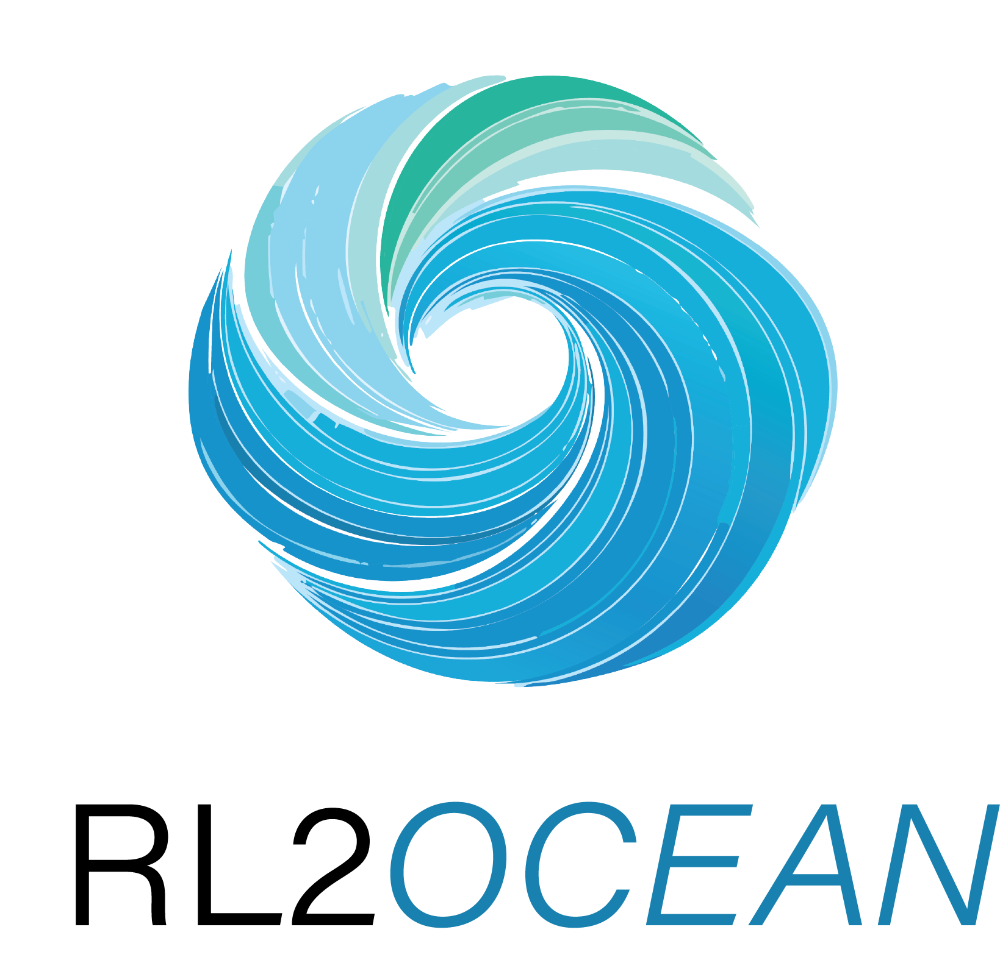

###############################################################
Calibration and Validation Algorithm Theoretical Basis Document
###############################################################

.. list-table:: Document information
   :widths: 30 70

   * - Document ID
     - |document-id|
   * - Issue
     - |issue|
   * - Date
     - |date|
   * - Status
     - |status|
   * - Processor
     - |processor|
   * - Copyright
     - |copyright|
   * - Distribution and license
     - `CC BY 4.0 <https://creativecommons.org/licenses/by/4.0>`_

.. rubric:: Authors and approval

The LaTeX cover lists author placeholders rather than individual names.

.. list-table::
   :header-rows: 1
   :widths: 40 60

   * - Author
     - Organisation
   * - Author 1 (name not provided)
     - Norwegian Meteorological Institute (MET Norway)
   * - Author 2 (name not provided)
     - Institute of Marine Sciences (ISMAR-CNR)
   * - Author 3 (name not provided)
     - Barcelona Expert Center (BEC ICM-CSIC)
   * - Author 4 (name not provided)
     - Delft University of Technology (TU Delft)
   * - Author 5 (name not provided)
     - German Aerospace Center (DLR)

Approval and authorisation records are not specified in the source.

.. rubric:: Change records

.. list-table::
   :header-rows: 1
   :widths: 15 20 45 20

   * - Issue
     - Date
     - Description
     - Author
   * - 0.2
     - Not stated
     - Source issue
     - RL2Ocean consortium
   * - |issue|
     - |date|
     - Sphinx migration
     - RL2Ocean consortium

.. note::

   The source abstract contains only Lorem ipsum placeholder text and is not
   reproduced. The source's substantive content and section outline are
   preserved; headings without body text are identified in the relevant
   chapters rather than filled with invented material.

.. only:: html

   The document structure and numbering are defined by the Sphinx toctree
   below.

.. toctree::
   :maxdepth: 4
   :numbered: 4
   :caption: Contents

   01_introduction
   02_processing_model
   03_lband_sar_datasets
   04_auxiliary_datasets
   05_reference_datasets
   03_algorithms
   04_uncertainty_analysis
